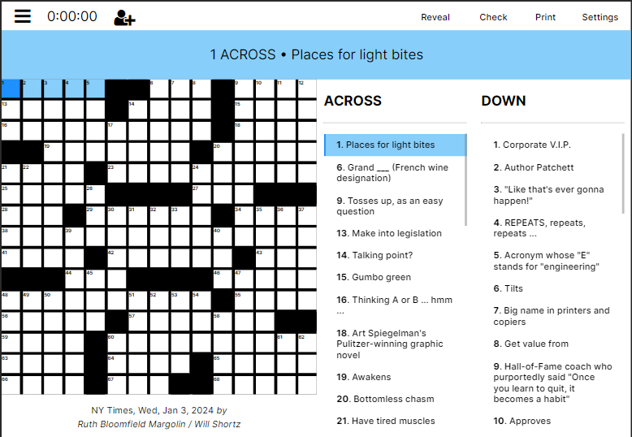

# NYT Crossword Clone

## About the Project



This project is a web-based clone of the New York Times crossword. The application fetches the daily crossword through an API call to the New York Times Syndicate.

Basic features of the NYT crossword are present, such as checking and revealing answers. In progress features include saving game progress, multiplayer option, and error-check mode.

## Built With


## Getting Started

### Prerequisites

+ Node.js
+ NPM

### Installation

1. Clone the project using 
```
git clone https://github.com/alicia4550/nyt-crossword.git
```

2. Navigate to the project's root directory.

3. Run the `install.bat` file.

### Usage

1. Navigate to the project's root directory.

2. Run the `run.bat` file.

3. Open `http://localhost:5173/` in your local browser.

## License

Distributed under the MIT License. See `LICENSE.txt` for more information.